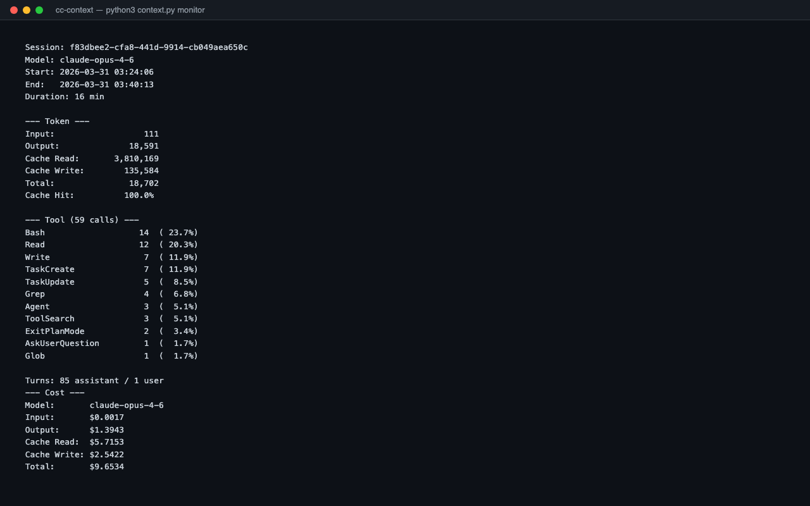

# cc-context

**English** | [中文](README_CN.md)

A CLI toolkit for Claude Code context engineering — monitor token usage, save context snapshots, and detect session anti-patterns.

**No dependencies.** Python stdlib only.

[](LICENSE)
[](https://python.org)

---



---

## What can cc-context do?

| Feature | Description |
|---------|-------------|
| **Token Monitor** | Parse `.jsonl` session files, show token consumption by tool type, cache hit rates, cost estimates |
| **Context Snapshot** | Save context snapshot (modified files, tool stats, token summary) to markdown |
| **Health Check** | Detect anti-patterns: repeated searches, oversized reads, too many turns |

## Install

```bash
git clone https://github.com/zengtianli/cc-context.git
cd cc-context
python3 context.py monitor
```

Requirements: Python 3.10+ (stdlib only, no pip dependencies).

## Quick Start

```bash
# Monitor latest session
python3 context.py monitor

# Monitor specific session
python3 context.py monitor --session SESSION_ID

# All sessions as JSON
python3 context.py monitor --all --json

# Save context snapshot
python3 context.py snapshot save

# Restore latest snapshot
python3 context.py snapshot restore

# Health check
python3 context.py health

# Health check all sessions
python3 context.py health --all

# Install auto-save hook
python3 context.py hooks install
```

## What It Detects

**Health checks:**
- Sessions with >100 turns
- Sessions lasting >3 hours
- Cache hit rate below 80%
- Same file read more than 3 times

**Anti-patterns:**
- Repeated grep/glob with identical queries
- Large file reads without offset/limit
- Identical Bash commands run multiple times
- Very large assistant outputs (>5000 tokens)

## Cost Tracking

Supports pricing for:
- `claude-opus-4-6` — $15/$75 per 1M input/output tokens
- `claude-sonnet-4-6` — $3/$15 per 1M input/output tokens
- `claude-haiku-4-5` — $0.80/$4 per 1M input/output tokens

Cache read/write pricing included.

## License

MIT
